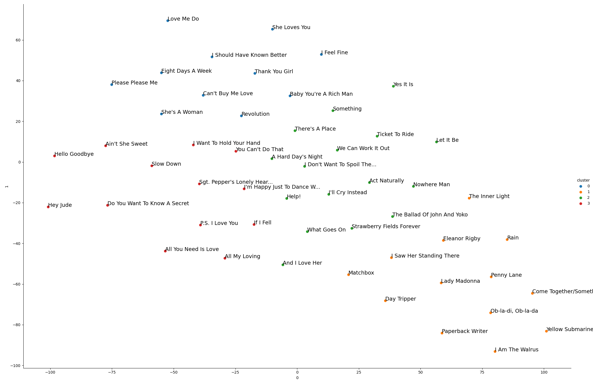

# Reading songs: A computational analysis of popular song lyrics

## Abstract
There is no doubt that certain songs are so easily liked by the public because of their melody. However,certain songs strike us for their lyrics, either if they convey an important (for us) meaning, or for theircaptivating sound when sung. Since 1958, the Billboard magazine held the special section Hot 100, with a rank of the 100 most popular songs of the week.  Exploiting this invaluable source regarding the musical taste of the past decades until our days, we perform an analysis over various aspects of popular songs’ lyrics, especially focusing on the question: what is the importance of lyrics, when classifying musical artists and genres? We find out that, as we expected, many artists are not immediately recognizable only by their lyrics: some of them, however, and especially if they belong to some specific genres (such as rap), stands out, opening to the possibility of further analysis over their styles and themes.

## Python Environment
To run our code, please install the required dependencies in the `requirements.txt` file we provide at the root of this repo. Assuming you're
at the root of the repo:  
`pip install -r requirements.txt`

## Dataset
The dataset is not published together with this repository. You can however download the Billboard dataset on [Kaggle](https://www.kaggle.com/dhruvildave/billboard-the-hot-100-songs). In order to retrieve other kind of information (such as genres and lyrics), you can use the `fetch_data.py` in the `crawler` package. You will need to signup for [Genius.com](https://docs.genius.com/) and the [Last.fm](https://www.last.fm/api) HTTP APIs.  

Once obtain your API credentials, create the `crawler/access_tokens.py` file with the following content:  
```python
credentials = {
    'genius': {
        "client-id": "YOUR-CLIENT-ID",
        "client-secret": "YOUR-CLIENT-SECRET",
        "token": "YOUR-TOKEN",
    },
    'lastfm': {
        'key': 'YOUR LAST-FM KEY',
        'secret': 'YOUR LAST-FM SECRET'
    }
}
```
  
You should be then good to go, run `fetch_data.py` to fetch either genres, lyrics or both.